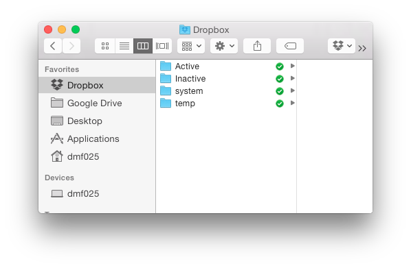
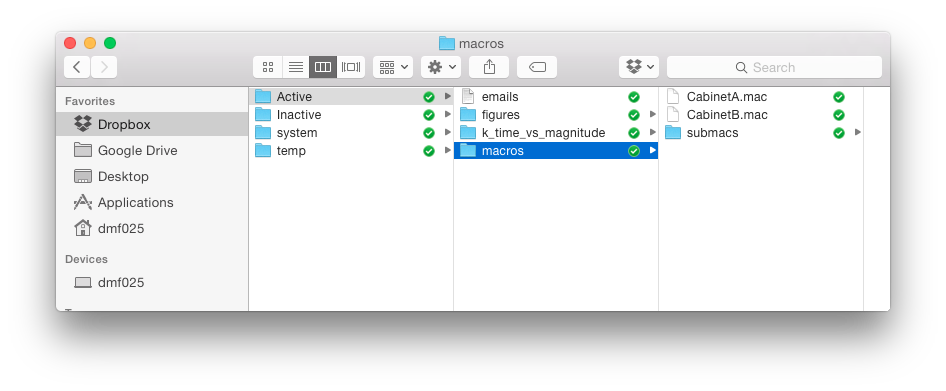
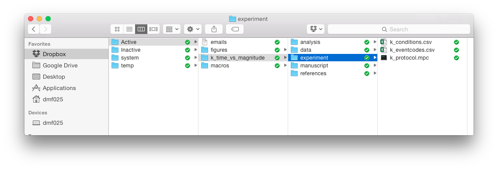
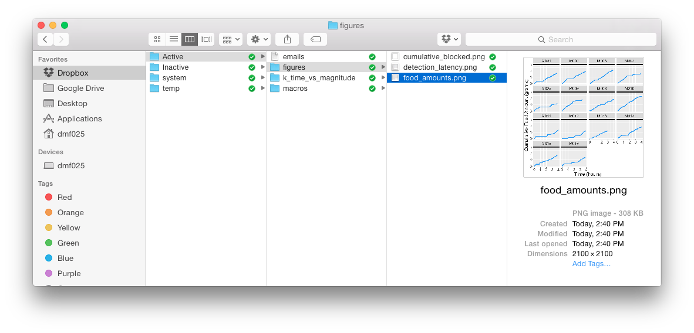
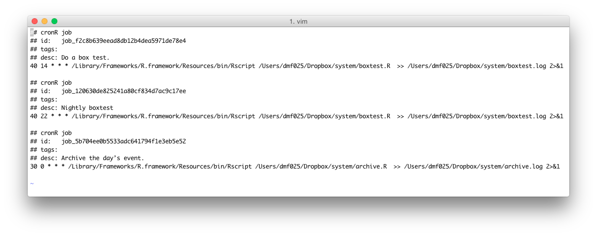
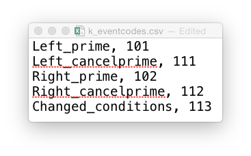
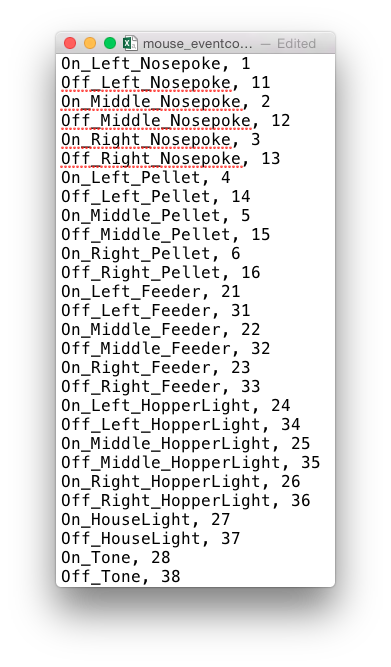

```{r setup, include=FALSE}
knitr::opts_chunk$set(echo = TRUE)
```

## Introduction
## Folders & Files

A Dropbox account is **highly** recommended. In our experience, Google Drive is slow, cpu intensive when synching, and fails to sync more often than Dropbox. Using a remote server is fine, except that in our experience it is a hassle to make sure you are always connected to it from any computer you're likely to be working on. In what follows, we will assume you will use dropbox, but if not, you can replace all mention of dropbox with the top level folder you are using.

The dropbox folder should have at least 2 folders in it: _Active_ and _system_. Our dropbox account has 4, and is shown below.



### The _Active_ Folder

The Active folder contains settings specific to the currently active experiments. At a minimum, it should contain _macros_, _figures_, and the folder for any currently active experiments. If you would like email notifications, you must also include a text file named _emails.txt_ that contains the email addresses of those that should receive email notifications, one email per line.

The _figures_ folder contains the figures that are automatically generated by the daily analyses scripts that are run.

The _macros_ folder contains, in our case, the macros for the two cabinets that house the indidivual rodent chamber. It also contains an additional folder, _submacs_ that contain the settings for each indvidual rodent chamber. These macros can be automatically generated, as described later.



Every experiment should be placed in its own separate folder. The folder must begin with the experiment ID followed by an underscore. This requirement is in place because the software ensures all aspects of the experiment are valid and connected, and it does this using the unique experiment identifier. In the example shown below, the active experiment has experiment ID _k_ and is named *time_vs_magnitude*.

The folder structure of each experiment data file must be nearly identical. This is because the software assumes the location of several key files, like the protocol that runs the MPC code. The experiment folder must have, at a minimumn, _data_ and _experiment_ folders.

The _data_ folder contains two additional folders, _mpc_ and _json_. The _mpc_ folder is where the mpc files are saved to disk in real-time by the MedPC software. The _json_ folder is where the daily .JSON files are kept. These JSON files contain the raw data from each mpc file each day, but also contains the protocol, conditions, and event codes that were in place that day. This JSON file is a key component of our system as it allows you to keep your data and the metadata in a single place. This file format was chosen because of its widespread use in computer science. It is a standard format for storing heirarchical data. In the fully automated system, a single JSON file is created automatically each day. This ensures that the metadata is tied to the data as soon as possible. By storing the data in separate JSON files, we maximize the information contained in each file per day, and minimize the fallout from having lost a data file (as would happen if all the data were stored in a single file).

The _experiment_ folder must contain at a minimum *ID_protocol.mpc*, *ID_conditions.csv*, and *ID_eventcodes.csv*. You should replace _ID_ with your unique experiment ID. These files control the experiment. A picture of our current experiment folder is shown below.


The *k_protocol.mpc* file contains the the actual mpc code that runs the operant chambers.\
The *k_conditions.csv* file contains the conditions for every rat in the experiment. \
The *k_eventcodes.csv* file contains the eventcodes specific to your particular experiment (a more general event codes file specific to the entire system is in the _system_ folder, described later)

These files must be kept up-to-date because these are joined with the data per day in the JSON file.

The image above shows several additional folders we use in our lab for each experiment: _analyses_ stores the analysis code (we call the entry point to the code *k_main.R*), the _manuscript_ folder (which contains constantly updating drafts of the manuscript), and a _references_ folder that contains PDFs of the references particularly relevant for this experiment.

### The _system_ folder

Zooming back out, the Dropbox folder must also contain a folder called _system_. This folder contains files that are general to the entire running system. 

The *mouse_eventcodes.csv* file contains the eventcodes that are general to the system. This includes every nosepoke, or the onsets and terminations of hopper lights, the delivery of food pellets, the detection of those pellets, etc. All eventcodes specific to an experiment (for example, a trial start code) should be kept in the experiment specific event codes file described above (e.g., *k_eventcodes.csv* in the _experiment_ folder). \
The _boxtest.R_ file runs the automated boxtests to check for a functioning system. For example, it checks the latency between the delivery of a food pellet and when it finally is detected in the food cup (a long delay can indicate a malfunctioning feeder). Another example is to check the amount of food consumed in a day. It should generate figures that are put in _Active/figures_ folder. An example is shown below.


The _archive.R_ file reads in the daily mpc files and converts them to JSON. \
The _macros.R_ file reads in the *ID_conditions.csv* file and automatically creates the macros in the _Active/macros_ folder.

These R files are designed to be run from the command line, although they can be run in R or RStudio as well. Because the code can be run from the command line, it is easy to have them run based on a operating system specific scheduler. For example, below is the crontab schedule for our system. It shows 3 scheduled jobs. At 2:40pm ("40 14 * * *") and 10:40pm the boxtest.R file is run and the output is logged. (These times were chosen because they are 10 minutes after the active feeding period in the experiment). And a third job runs and logs the _archive.R_ file at 12:30am (30 minutes after the date changed).



Lastly, our setup has an _Inactive_ folder for completed projects, and a _temp_ folder for temporary files. When an experiment is finished, we simply move it from _Active_ to _Inactive_. This is important because the automated system will look for and identify any active experiments by looking in the _Active_ folder. It alerts you to any conflicts (for example, if different protocols are to be run for the same mouse), and this prevents you from storing completed experiments in the _Active_ folder.


### Eventcodes

There are two eventcodes files, the general one is stored in the _system_ folder, and the experiment-specific one is stored in the *Active/ID_experiment/experiment* folder, as described above. Both of these files are simply csv files that store eventname, eventcode pairs. For example, here are a snapshot of the *mouse_eventcodes.csv* and *k_eventcodes.csv* csv files. 




The data itself is stored using the event code. This allows us to store the data directly from MedPC as time.event pairs. The number before the period in the raw data is the MedPC timestamp, and the number after the period is the event code. For example, a line in the MedPC file that reads 16735.021 is parsed at the period. The timestamp 16735 corrosponds to 167.35 seconds since the protocol was loaded, and the event code 21 corrosponds to an On_Left_Feeder event. That is, a pellet was delivered into the left hopper 167.35 seconds after the protocol was loaded.

The eventcodes file forms a mapping between the event and the code in a way that the system can read in and match quickly and easily. The software component of the system knows to transform the event codes into event names when the files are loaded into memory for analysis. This allows the user to use the event name (e.g., "On_Left_Feeder" instead of the event code 21) in the analyses. Both the general and experiment-specific eventcodes files are stored with the data in the JSON file every day. This compromise allows us to store data efficiently, but analyze that data using human-readable events.

### Conditions
### MedPC

